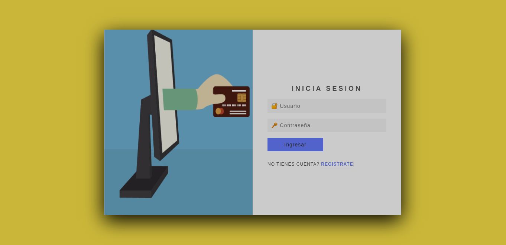

# DSWI - Desarrollo de servicios Web I
Template para una tienda virtual, proyecto del curso de desarrollo de servicios web I
con inicio de sesión basico en javascript

# Capturas de Pantalla
## Inicio de sesión

# Despliegue
La pagina esta desplegada en [Github Pages](https://pages.github.com/) en este [enlace](https://deyvis17gy.github.io/dswi/)

# Ejecutar de manera local
1. Clona el repositorio [https://github.com/Deyvis17GY/dswi.git](https://github.com/Deyvis17GY/dswi.git)
2. Ingresa a index.html 
3. Ejecuta Live Server
4. Para iniciar sesión las credenciales son:
    - Usuario: admin
    - Contraseña: 1234